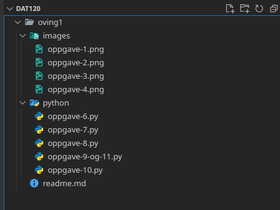

# Oppgaver

## Oppgave 1


## Oppgave 2


## Oppgave 3


## Oppgave 4


## Oppgave 5
```py
verdi1 = input("Skriv inn et tall: ")
verdi1_tall = float(verdi1)
verdi2 = input("Skriv inn et tall til: ")
verdi2_tall = float(verdi2)
resultat = (verdi1_tall + verdi2_tall)/2.0
print(resultat)
```

1. Vi tar inn et tall fra brukeren. Dette blir lagret som en string i variabelen `verdi1`.
2. Vi konverter variabelen `verdi1` til flyttall (desimal tall) i variabelen `verdi1_tall`. (OBS!: Gir feilmelding om no annet en tall og `.` dukker opp)
3. Vi tar inn et tall fra brukeren igjen. Dette blir lagret som en string i variabelen `verdi2`
4. Vi konverter variabelen `verdi2` til flyttall (desimal tall) i variabelen `verdi2_tall`. (OBS!: Gir feilmelding om no annet en tall og `.` dukker opp)
5. Vi summerer flyttallene i variablene `verdi1_tall`og `verdi2_tall` sammen, før man deler det på to. Dermed blir det lagret i `resultat` variabelen
6. Variabelen `resultat` blir lest av og skrevet inn i konsollen

## Oppgave 6

[Oppgave 6](./python/oppgave-6.py)

## Oppgave 7

[Oppgave 7](./python/oppgave-7.py)

## Oppgave 8

[Oppgave 8](./python/oppgave-8.py)

## Oppgave 9 og 11

[Oppgave 9 og 11](./python/oppgave-9-og-11.py)

## Oppgave 10

[Oppgave 10](./python/oppgave-10.py)
